## Haiiiii! im noelle!
#### smol dev, heavy sleeper and cool :3

### what me?
- **16**, she/her, trans girl :3

### what do?
i made a few things, check em out :3c
- 🚀 **Galaxy Protectors** (2019)
  - My first game, based on a GDevelop Example.
  - Taught me how to start making games.
- ⬜ **Color Touch** (2020)
  - Simple game in which you match colors.
  - Taught me how to work with Block Code Logic.
- ☁️ **WeatherApplet** (2021)
  - Simple weather app.
  - Taught me how to work with API's and UI/UX Design.
- 🎵 **Beatshape** (2021)
  - 4-Key rhythm game based on osu!mania.
  - Taught me how to create APIs using NodeJS, Rhythm Game Mechanics, and Game Design.
- 📊 **AstroUp**, **AstroBot** and **AstroRootKit** (2022)
  - API / Data services for "Astrogon".
  - Learned Computer Security which helped me learn how to better secure games/servers.
- ⛏ **Chaos Realm 2** (2022)
  - MC Java server with custom plugins written by me.
  - Had plugins that expanded on the game's features, such as Economy, Custom Items, and Bosses.
- ⚔ **BGPE** (2023)
  - Decompilation of "Blocky Gun Paintball".
  - Expansion of the game, including new features, maps, etc.
- 💾 **byteTable** (2023)
  - Simple but fast database that works with JS Objects, and Buffers.
  - Includes Encryption, Compression, and Support for JS Objects / Arrays.
- 🌠 **Cosmo** (2024)
  - Astrogon Mod Wrapper/Client
  - Added various bug fixes, modding APIs, private servers, and some cpp and nw-gyp.
### what stats?

<!-- hiiii!!! ur so cool for reading my source,,, hehe~ -->

    
  

